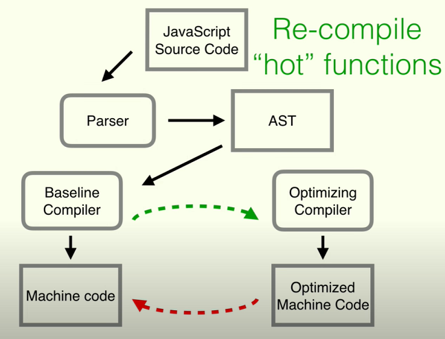
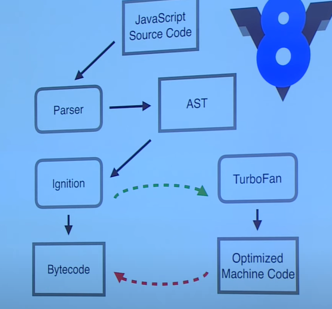

# JavaScript engine - optimizing compiler

JavaScript engine 의 optimizing compiler 에 관해 정리를 해보려고 한다. 

주요 내용은 [구글 V8 팀 멤버의 발표](https://www.youtube.com/watch?v=p-iiEDtpy6I)를 기반으로 한다.

<br>

### JavaScript engine 이란

JavaScript engine 은 대표적으로 V8, SpiderMonkey, Chakra 등이 있다.

기본적으로 JavaScript engine 은 JavaScript 코드를 machine code 로 변환하는 역할을 한다.

<br>

### JIT

dynamically typed 한 언어임에도 어떻게 그렇게 빠를 수 있을까?

JIT(Just In Time) compilation 에 의해 가능하다. JIT compilation 을 통해 machine code 를 runtime 에 생성한다.

AOT(Ahead Of Time) compilation 을 수행하지 않아서 프로그램을 실행하기 전에 미리 compile 하지 않는다.

compile 과 execution 의 단계를 나누지 않고 동시에 진행한다.

C++ 는 compilation 과 execution 이 별개로 이루어진다면 JavaScript 는 compilation 과 execution 이 동시에 이루어진다.

<br>

### Optimizing compiler

> re-compile hot functions with type information from previous execution

> de-optimize if the type has changed


<br>

#### JavaScript engine flow

아래는 [구글 V8 팀 멤버의 발표](https://www.youtube.com/watch?v=p-iiEDtpy6I) 11분 20초 즈음에 나온 이미지다.



<br>

#### v8 engine flow

아래는 [구글 V8 팀 멤버의 발표](https://www.youtube.com/watch?v=p-iiEDtpy6I) 12분 50초 즈음에 나온 이미지다.



baseline compiler 에 대응되는 v8 의 baseline compiler 는 Ignition 이 담당한다.

optimizing compiler 에 대응되는 v8 의 optimizing compiler 는 TurboFan 이 담당한다.

Ignition 은 baseline compiler 와 달리 machine code 가 아닌 byte code 로 변환한다.

machine code 는 CPU 에 의해 직접 동작하는 코드라면 byte code 는 JVM 과 같은 가상 머신에서 동작하는 코드다. 가상 머신에서 동작하므로 OS 의 종류에 관계없이 동작할 수 있다.

byte code 는 machine code 와 source code 중간에 놓인 코드다. CPU 는 byte code 를 이해할 수 없어서 machine code 로 변환하는 작업이 필요하다.

~~machine code 와 byte code 에 대한 차이는 추가 학습이 필요하다.~~

<br>

#### re-compile & de-compile

modern JavaScript engine 은 compiler 를 대체로 2개 이상 갖는데, 그 중 하나가 Optimizing compiler 다.

Optimizing compiler 는 hot function 을 recompiling 한다. hot function 은 많이, 자주 사용되는 함수라는 의미를 갖는다. hot function 은 많이 사용되기 때문에 최적화(optimize) 할 필요가 있다. 이때의 최적화는 machine code 에 대한 최적화를 의미한다.

Optimizing compiler 는 많이 사용되는 함수들에 대해서 정보를 수집하는데 특히 타입에 대한 정보가 중요하다. 최적화를 진행할때 이전에 사용됐던 타입과 유사한 타입을 사용할 것이라고 예상한다.

그러나 JavaScript 는 dynamically typed 하기 때문에 다른 타입을 사용할 수 있다. 그러면 Optimizing compiler 는 optimzed code 에 대한 de-optimize 를 수행하게 된다. 최적화 시켜놓은 코드를 다시 최적화하지 않은 상태로 되돌린다.

<br>

### 가능한 type 을 변경하지 말 것

optimizing compiler 는 이전에 사용한 type 정보를 바탕으로 최적화를 진행하므로 발표자는 이미 작성한 코드의 type 을 바꾸지 말라고 조언한다. 타입을 바꾸면 de-optimizing 을 진행하게 된다.

<br>

```javascript
function load(obj) {
  return obj.x;
}
```

load 함수는 파라미터로 선언한 obj 의 프로퍼티 x 를 반환하는 단순한 함수다.

그렇지만 compiler 에게는 꽤 복잡한 일이다. compiler 는 obj 가 x 를 실제로 갖고 있는지, 프로토타입 체인 어딘가에 속해있는지, 메모리 어디에 x 가 저장되어 있는지 등을 파악해야 한다.

<br>

```javascript
function load(obj) {
  return obj.x;
}

load({x: 4, y: 7});
load({x: 2, y: 9});
load({x: 1, y: 3});
load({x: 6, y: 1});
load({x: 3, y: 8});
```

load 함수를 호출하면서 객체를 인자로 넣는다. 

x 와 y 의 값이 다를지라도 같은 프로퍼티(키와 값을 가리킨다) 키 x, y 가 계속 쓰이면서 프로퍼티 값의 타입이 변하지 않고 계속해서 number 로 호출된다.

compiler 는 이를 hot function 이라고 간주하고 최적화를 진행한다.

<br>

이에 대한 assembly code 코드에서는 parameter 에 대한 타입을 저장해둔다. 

새롭게 함수가 호출되면 저장해둔 paramter 의 타입과 새로 들어온 parameter 의 타입이 같은지 비교한다.

assembly code 에서는 obj 객체의 프로퍼티 키에 대한 메모리 주소 정보를 갖고 있다. 프로퍼티 키에 대한 일종의 지름길을 갖고 있어서 빠르게 접근할 수 있다. 

타입이 같다면 프로토타입 체인을 살펴보거나 side effect 가 있는지 등을 검사하지 않아도 되고, 프로퍼티 키의 메모리 주소에 바로 접근해서 바로 값을 가져올 수 있다.

타입이 다르다면 de-optimize 를 명령하는 메모리 주소로 이동한다.

<br>

타입은 프로퍼티 값에 대한 것 뿐만 아니라 프로퍼티 키의 종류도 해당한다.

```javascript
function load(obj) {
  return obj.x;
}

load({x: 4, a: 7});
load({x: 2, b: 9});
load({x: 1, c: 3});
load({x: 6, d: 1});
```

compiler 는 위의 코드에 대해 프로퍼티가 다르므로 같은 타입이 아니라고 판단한다.

assembly code 에는 load 함수 호출에 사용된 객체인 {x: 4, a: 7}, {x: 2, b: 9}, {x: 1, c: 3}, {x: 6, d: 1} 에 대한 각각의 메모리 주소 정보(객체 자체 뿐만 아니라 프로퍼티에 대한 정보도 포함한다)를 갖는다.

그리고 load 함수에 대한 새로운 호출이 발생하면 4개와 각각 비교하게 된다. 

4개 중 하나라도 같은 타입이 있다면 메모리 정보를 바탕으로 빠르게 프로퍼티 값에 접근할 수 있다.

4개 중 같은 타입이 하나라도 없으면 de-optimize 를 진행한다.

모든 JavaScript engine 에 해당하는 내용인지는 모르겠지만 4번을 초과하는 비교를 수행하지 않는다고 한다. 특정 함수 호출에 사용된 객체의 메모리 정보를 4개 까지만 갖고 이 다음부터는 추가로 객체의 메모리 정보를 저장하지 않는다.

객체의 프로퍼티 키에 대해 개별적으로 방대한 기존 메모리 리스트에서 프로퍼티 키와 같은 정보가 있는지 조회한다(없으면 어떻게 되는지는 설명하지 않았고 expensive 한 call 이라고만 표현했다).

<br>

### Write code that looks like statically typed.

성능을 위해 객체에 대한 타입을 변경하지 말라고 얘기한다.

같은 프로퍼티 키를 유지하면서 값이 없으면 프로퍼티를 빼지 않고 차라리 값을 undefined 로 설정하는 편이 낫다고 한다. compiler 는 같은 타입으로 간주할거고 그러면 메모리에 빠르게 접근할 수 있다.

```javascript
function load(obj) {
  return obj.x;
}

load({x: 4, a: 7, b: undefined, c: undefined, d: undefined});
load({x: 4, a: undefined, b: 9, c: undefined, d: undefined});
load({x: 4, a: undefined, b: undefined, c: 3, d: undefined});
load({x: 4, a: undefined, b: undefined, c: undefined, d: 1});
```

<br>

### 참고

https://ko.wikipedia.org/wiki/%EC%9E%90%EB%B0%94%EC%8A%A4%ED%81%AC%EB%A6%BD%ED%8A%B8_%EC%97%94%EC%A7%84

https://www.youtube.com/watch?v=p-iiEDtpy6I

https://evan-moon.github.io/2019/06/28/v8-analysis/

https://www.tutorialspoint.com/difference-between-bytecode-and-machine-code

https://byjus.com/gate/difference-between-byte-code-and-machine-code/

